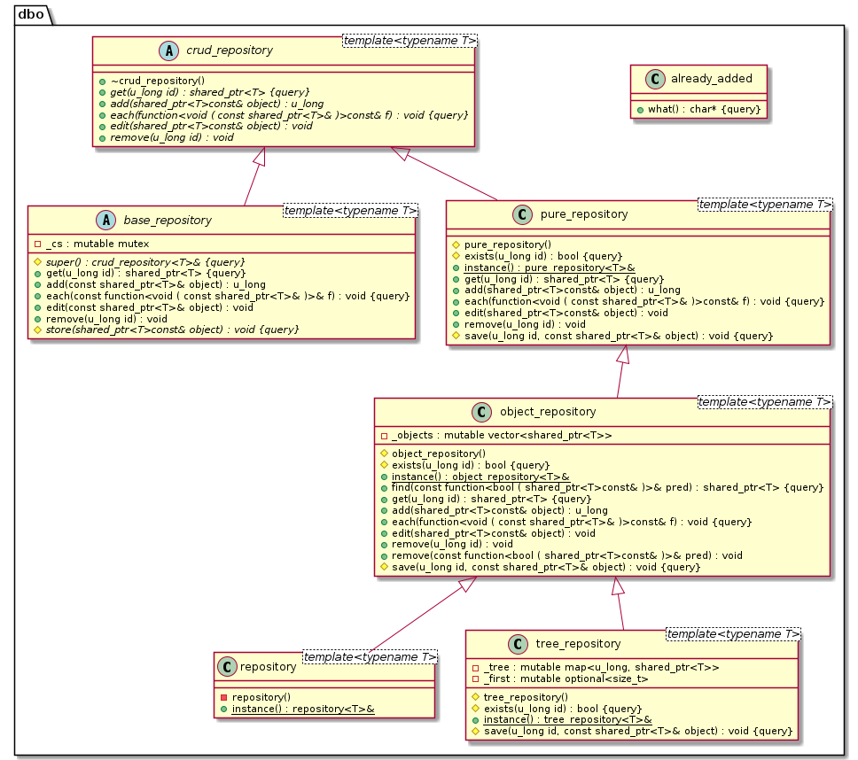

= object-repository

Unified crud repository for objects

== Type hierarchy

== How to use

----
using namespace dbo;

auto id = repository<widget>::instance().add(make_shared<widget>());
auto object = repository<widget>::instance().get(id);
object->set_field(value);
repository<widget>::instance().edit(object);
repository<widget>::instance().each( {
  cout << obj->get_id() << ": " << obj->get_field() << endl;
});
repository<widget>::instance().remove(id);
----
